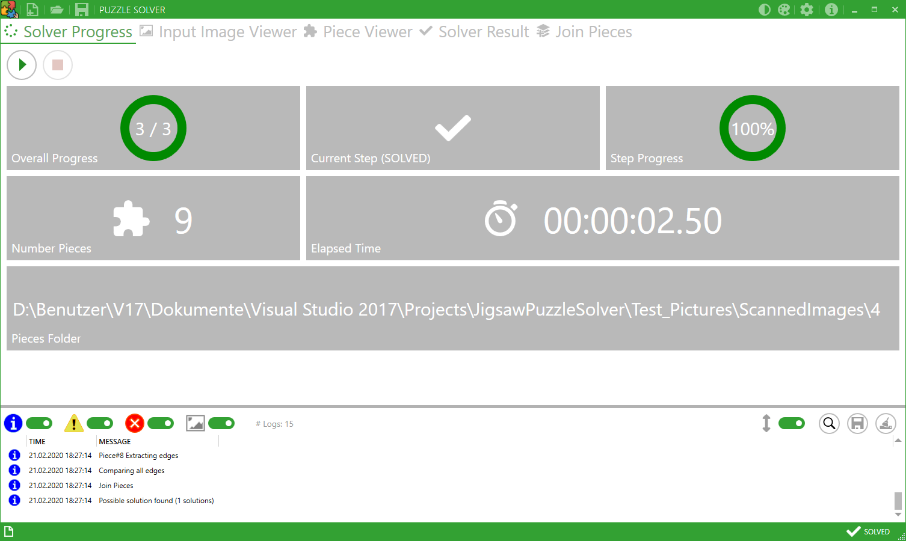

# JigsawPuzzleSolver

Solving jigsaw puzzles by comparing the edges of the puzzle pieces against each other and joining them.
The solver only uses the shapes of the edges to compare them. No color matching is done.

## Usage
1. Scan all puzzle pieces that should be joined. There can be multiple pieces per input image. The single pieces are extracted from the input image by segmentation. Scan the rear side of the pieces to get better edges.
2. "Open a new puzzle" by clicking the button on the GUI. Select the folder that contains all scanned images. Subfolders are ignored.
3. "Start solving" by clicking the button on the GUI. You can stop the solving during each step.
4. When the solver is finished, you can see the result(s) in the "Solver Result" tab.
5. Use the "Join Pieces" Tab to join the pieces.

## Solver Steps
1. **Initialize Pieces:**
   a) Extract all pieces from the input images.
   b) Find the 4 corners of the piece.
   c) Extract the edges between the corners.
   d) Classify the piece based on the edge types.
2. **Compare edges:** Compare all piece edges against each other. Build a list with all match scores and sort it ascending by the scores (best/lowest scores first). Remove all scores above a specific value. 
3. **Solve puzzle:** Join all pieces beginning with the best matching edges. Edges are joined until no good match is left or until all pieces are joined.

## Settings
Use the settings menu to adapt the solver to your puzzle. Many parameters can be changed either to improve solver quality or speed. Refer to the tooltips of the controls for further informations.

## Algorithms
The algorithms for extracting and matching pieces are taken from https://github.com/jzeimen/PuzzleSolver and adapted.
Thanks for this great project. 

## Window Icon
WindowIcon made by Freepik from www.flaticon.com/free-icon/jigsaw_993686